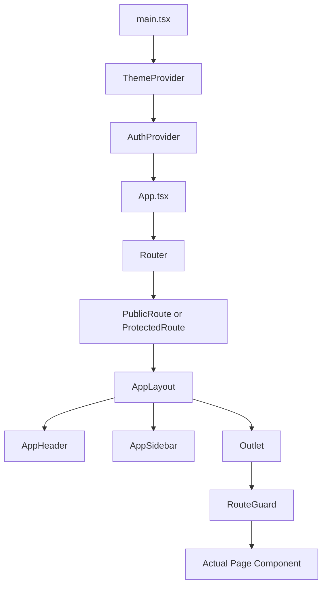
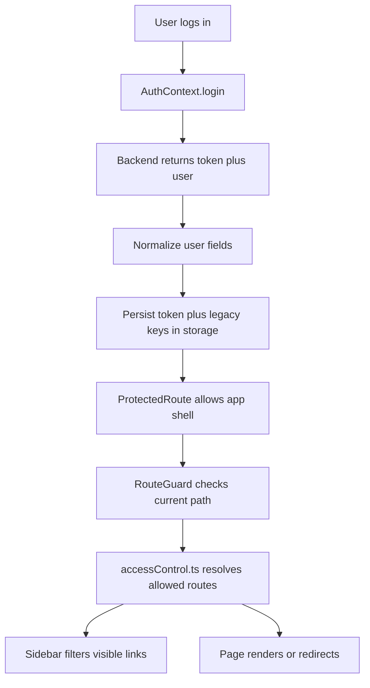
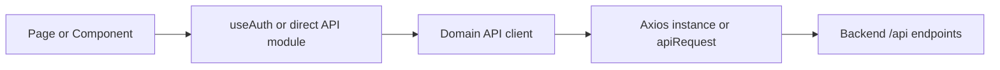

# Frontend Engineering Guide

## Overview

This frontend is a single Vite + React application that serves multiple business modules from one codebase:

- Sales Workspace
  O2D, Lead-to-Order, BatchCode
- Checklist Combined
  Checklist, Maintenance, Housekeeping
- Store and Purchase
- HRMS
- Subscription / Document Control
- Visitor Gate Pass
- Master utilities

The app uses:

- React 19
- React Router 7
- TypeScript and JavaScript together
- Vite 6
- Tailwind CSS 4
- Axios
- Context API for shared state

This document explains the real project structure, data flow, API organization, routing, access control, and how to safely extend the app.

---

## Quick Start

### Requirements

- Node.js 18+
- npm
- A running backend API

### Install

```bash
npm install
```

### Run in development

```bash
npm run dev
```

### Build

```bash
npm run build
```

### Preview production build

```bash
npm run preview
```

---

## Environment Variables

These variables are referenced in the current codebase:

| Variable | Purpose |
| --- | --- |
| `VITE_API_BASE_URL` | Main backend base URL. Used by Vite proxy and most API clients. |
| `VITE_API_BASE_USER_URL` | Legacy/alternate auth base URL for some login flows. |
| `VITE_API_TIMEOUT_MS` | Checklist API timeout override. |
| `VITE_ENABLE_SESSION_REVOCATION_POLLING` | Enables periodic session verification. |
| `VITE_SCRIPT_URL` | Checklist maintenance task assign integration. |
| `VITE_SHEET_ID` | Checklist maintenance sheet integration. |
| `VITE_MAYTAPI_PRODUCT_ID` | BatchCode WhatsApp integration. |
| `VITE_MAYTAPI_PHONE_ID` | BatchCode WhatsApp integration. |
| `VITE_MAYTAPI_TOKEN` | BatchCode WhatsApp integration. |
| `VITE_MAYTAPI_GROUP_ID` | BatchCode WhatsApp integration. |

Example local `.env`:

```env
VITE_API_BASE_URL=http://localhost:3000
VITE_API_BASE_USER_URL=http://localhost:3000
VITE_API_TIMEOUT_MS=120000
VITE_ENABLE_SESSION_REVOCATION_POLLING=false
```

---

## High-Level Architecture

### Boot Flow



### Auth and Navigation Flow



### API Layer Flow



---

## Tech Stack

### Runtime and Build

- `React 19`
- `React Router 7`
- `Vite 6`
- `TypeScript 5`

### UI and Styling

- `Tailwind CSS 4`
- `Lucide React`
- Radix UI primitives
- `react-hot-toast`
- `swiper`
- `flatpickr`
- `apexcharts`, `recharts`

### Forms and Validation

- `react-hook-form`
- `zod`

### Data and Networking

- `axios`
- custom API client wrappers

### Specialty Libraries

- `exceljs`, `xlsx`
- `jspdf`, `jspdf-autotable`
- `react-pdf`
- `leaflet`, `react-leaflet`
- `@fullcalendar/*`

---

## Folder Structure

This is the practical structure developers should understand first.

```text
frontend/
├─ public/
├─ src/
│  ├─ api/
│  │  ├─ apiClient.ts
│  │  ├─ batchcodeAPI.ts
│  │  ├─ leadToOrderAPI.ts
│  │  ├─ o2dAPI.ts
│  │  ├─ checklist/
│  │  ├─ document/
│  │  ├─ gatepass/
│  │  ├─ hrfms/
│  │  ├─ master/
│  │  └─ store/
│  ├─ assert/
│  ├─ assets/
│  ├─ components/
│  │  ├─ batchcode/
│  │  ├─ charts/
│  │  ├─ header/
│  │  ├─ ui/
│  │  └─ UserProfile/
│  ├─ config/
│  ├─ context/
│  ├─ hooks/
│  ├─ icons/
│  ├─ layout/
│  ├─ lib/
│  ├─ pages/
│  │  ├─ AuthPages/
│  │  ├─ BatchCode/
│  │  ├─ checklist/
│  │  │  ├─ components/
│  │  │  ├─ context/
│  │  │  ├─ pages/
│  │  │  └─ utils/
│  │  ├─ Dashboard/
│  │  ├─ document/
│  │  ├─ gatepass/
│  │  ├─ hrfms/
│  │  ├─ LeadToOrder/
│  │  ├─ master/
│  │  ├─ O2D/
│  │  ├─ portal/
│  │  └─ store/
│  ├─ utils/
│  ├─ App.tsx
│  ├─ index.css
│  └─ main.tsx
├─ index.html
├─ vite.config.ts
├─ tsconfig.app.json
└─ package.json
```

### Important Notes

- `src/assert/` is currently spelled `assert`, not `assets`.
- The codebase is hybrid:
  some modules are TypeScript, some are still JavaScript/JSX.
- `@/` path alias points to `src/`.

---

## Important Entry Points

### `src/main.tsx`

Application bootstrap:

- mounts React
- wraps app in `ThemeProvider`
- wraps app in `AuthProvider`

### `src/App.tsx`

Main route registry:

- defines all module routes
- wraps protected app shell
- includes legacy redirects
- maps checklist legacy URLs to new `/checklist/*` URLs

### `src/layout/AppLayout.tsx`

Global shell:

- top header
- sidebar
- content outlet

### `src/layout/AppSidebar.tsx`

Sidebar renderer:

- groups navigation by module
- filters links using access control
- highlights active route

---

## Module Map

### Sales Workspace

Routes and pages under:

- `/o2d/*`
- `/lead-to-order/*`
- `/batchcode/*`

Key source folders:

- `src/pages/O2D`
- `src/pages/LeadToOrder`
- `src/pages/BatchCode`

### Checklist Combined

Routes and pages under:

- `/checklist/*`

Includes:

- checklist dashboard
- assign task
- delegation
- unified task page
- quick task
- task verification
- housekeeping verify
- machines
- settings

Key source folder:

- `src/pages/checklist`

### Store and Purchase

Routes under:

- `/store/*`

Key source folder:

- `src/pages/store`

### HRMS

Routes under:

- `/hrfms/*`

Key source folder:

- `src/pages/hrfms`

### Subscription / Document Control

Routes under:

- `/document/*`
- `/subscription/*`
- `/loan/*`
- `/payment/*`
- `/account/*`
- `/resource-manager`
- `/master`

Key source folder:

- `src/pages/document`

### Visitor Gate Pass

Routes under:

- `/gatepass/*`

Key source folder:

- `src/pages/gatepass`

---

## Routing Strategy

Routing is centralized in `src/App.tsx`.

### Layers

1. `PublicRoute`
   Used for login page.

2. `ProtectedRoute`
   Blocks unauthenticated users.

3. `RouteGuard`
   Blocks authenticated users from visiting pages they do not have permission to access.

### Why both `ProtectedRoute` and `RouteGuard` exist

- `ProtectedRoute` answers:
  "Is the user logged in?"
- `RouteGuard` answers:
  "Does the logged-in user have access to this route?"

This separation is correct and should be preserved.

---

## Access Control Theory

The access model is not only role-based. It is a combination of:

- `role`
- `system_access`
- `page_access`
- `store_access`
- employee-specific overrides for some store workflows

### Main file

- `src/utils/accessControl.ts`

This file is the rule engine used by:

- `RouteGuard`
- `AppSidebar`
- default navigation decisions
- legacy route normalization

### What it does

- normalizes old and new page names
- converts `page_access` CSV into real route paths
- maps `system_access` to module-level defaults
- handles checklist legacy routes
- handles store-specific access logic
- decides whether a path is allowed

### Practical rule

If a page is visible in sidebar but blocked in route guard, or vice versa, the first file to inspect is:

- `src/utils/accessControl.ts`

---

## Global State Management

This app uses Context API, not Redux.

### Current global providers

#### `AuthProvider`

File:

- `src/context/AuthContext.tsx`

Responsibilities:

- login/logout
- token persistence
- user normalization
- auth bootstrap on refresh
- route authentication state
- shared document state
- checklist compatibility state injection

This is the main application state container.

#### `ThemeProvider`

File:

- `src/context/ThemeContext.tsx`

Responsibilities:

- light/dark theme
- theme persistence to localStorage

#### `SidebarProvider`

File:

- `src/context/SidebarContext.tsx`

Responsibilities:

- desktop collapse state
- mobile open state
- hover state
- submenu state

### Important architecture note

`AuthContext` currently carries more than authentication. It also carries:

- document state
- checklist state via `useChecklistCompatibility`
- several mutation/fetch functions

That means it is the effective global service container for the frontend.

This is workable, but developers should know:

- it is powerful
- it is large
- changes inside it affect many modules

---

## Checklist Global State

Checklist is integrated into the global auth layer through:

- `src/context/useChecklistCompatibility.ts`

This hook exposes grouped state and actions for checklist-related features, including:

- dashboard
- assign task
- quick task
- delegation
- checklist task lists
- settings
- housekeeping
- maintenance

### State buckets inside `useChecklistCompatibility`

- `assignTaskState`
- `quickTaskState`
- `delegationState`
- `checklistState`
- `settingState`
- `housekeepingAssignState`
- `housekeepingState`
- `maintenanceState`

### Why this exists

Checklist originally had its own structure and APIs. This hook acts as a compatibility bridge so checklist pages can use the same global auth provider and still keep their domain-specific actions.

### Developer rule

If a checklist page uses `useAuth()` and something checklist-specific is available there, the implementation usually lives in:

- `src/context/useChecklistCompatibility.ts`

---

## Authentication Flow

### Login

Main file:

- `src/context/AuthContext.tsx`

Steps:

1. User submits credentials on login page.
2. `AuthContext.login()` calls backend login endpoints.
3. Token is decoded and user payload is normalized.
4. Token and user are stored in both `sessionStorage` and `localStorage`.
5. Legacy storage keys are also written for compatibility with old modules.
6. Axios default `Authorization` header is set.

### Logout

Steps:

1. Frontend clears local auth state immediately.
2. Storage is cleared.
3. Backend logout is sent as best-effort background request.
4. Protected routes redirect the user to login.

### Session restoration

On page refresh:

1. `AuthProvider` reads stored token.
2. It checks expiry.
3. It restores user state from storage or token payload.
4. It rehydrates legacy storage keys.

### Session revocation

Optional polling can verify whether server-side session is still valid:

- controlled by `VITE_ENABLE_SESSION_REVOCATION_POLLING`

---

## API Layer Organization

The frontend has multiple API clients because the app combines multiple products in one shell.

## Core clients

### `src/api/apiClient.ts`

Base shared Axios client for the unified app.

Responsibilities:

- sets base URL
- injects bearer token
- clears auth on revoked/expired session
- exports `apiRequest`
- exports `getStoredToken`

### `src/config/api.js`

Thin bridge file that re-exports the core API client.

### Checklist API

Files:

- `src/api/checklist/axios.js`
- `src/api/checklist/axiosInstance.js`
- `src/api/checklist/*.js`

Examples:

- `dashboardApi.js`
- `assignTaskApi.js`
- `settingApi.js`
- `delegationApi.js`
- `maintenanceApi.js`
- `housekeepingApi.js`
- `quickTaskApi.js`

### Document API

Files:

- `src/api/document/apiClient.ts`
- `src/api/document/documentApi.ts`
- `subscriptionApi.ts`
- `loanApi.ts`
- `paymentFmsApi.ts`
- `masterApi.ts`
- `extraApi.ts`

### Store API

Files:

- `src/api/store/storeApiRequest.ts`
- `storeSystemApi.ts`
- `storeSettingsApi.ts`
- `storeGRNApi.ts`
- `storeGRNApprovalApi.ts`
- `storeRepairFollowupApi.ts`

### Gate Pass API

Files:

- `src/api/gatepass/axiosInstance.js`
- `approvalApi.js`
- `allVisitors.js`
- `closePassApi.js`
- `requestApi.js`
- `requestWithFallback.js`
- `personApi.js`

### HRMS API

Files:

- `src/api/hrfms/apiRequest.js`
- `dashboardApi.js`
- `employeeApi.js`
- `leaveRequestApi.js`
- `requestApi.js`
- `resumeApi.js`
- `ticketApi.js`
- `planeVisitorApi.js`

### Legacy / module-specific single-file clients

- `src/api/leadToOrderAPI.ts`
- `src/api/o2dAPI.ts`
- `src/api/batchcodeAPI.ts`
- `src/api/master/*`

---

## API Implementation Guidelines

When adding a new endpoint:

1. Put it in the correct domain folder inside `src/api/`.
2. Reuse the module’s existing client instead of creating a new Axios instance.
3. Keep API files thin:
   they should only call backend endpoints and return normalized response data.
4. Keep UI state in components or context, not in API files.
5. If the API is checklist-specific and consumed globally, wire it through `useChecklistCompatibility`.

### Good pattern

```ts
export const fetchSomething = async () => {
  const { data } = await api.get("/api/module/something");
  return data;
};
```

### Avoid

- direct API calls spread across many unrelated components
- duplicate Axios instances for same module
- storing UI-only state in API modules

---

## How Global State Is Managed

### Use local component state when

- the state is only needed by one component
- the state is modal open/close, tab, search input, pagination UI, etc.

### Use context when

- auth/session affects many pages
- route visibility depends on it
- the same server data is shared across multiple pages in a module
- checklist actions need to be exposed through `useAuth()`

### Practical rule in this repo

- `useState` and `useMemo` for page-local UI
- `AuthContext` for cross-module auth and shared domain actions
- `SidebarContext` for shell layout state
- `ThemeContext` for theme

---

## Navigation and Sidebar System

Main files:

- `src/config/portalNavigation.ts`
- `src/layout/AppSidebar.tsx`
- `src/layout/AppHeader.tsx`

### `portalNavigation.ts`

Defines:

- top portal tabs
- alias mapping between system names and portal sections
- logic to decide which sidebar module should render for a path

### `AppSidebar.tsx`

Defines:

- section definitions
- grouped links
- access filtering using `getAllowedPageRoutes`
- active state logic
- admin-only items

### Important behavior

- top header controls module switching
- sidebar changes by module
- if a route belongs to checklist, store, document, HRMS, etc., a different sidebar section appears

---

## Important Shared Utilities

### `src/utils/accessControl.ts`

Permission engine.

### `src/utils/settingsAccessOptions.js`

Shared definitions for:

- system access options
- page access options
- page normalization for settings screens

Used to keep settings behavior consistent across modules.

### `src/config/portalNavigation.ts`

Top-level portal routing metadata.

### `src/utils/fileUrl.js`

Builds backend-backed file URLs from API base configuration.

---

## Folder-by-Folder Responsibilities

### `src/api`

Server communication layer.

### `src/components`

Reusable UI pieces shared across modules.

### `src/config`

Runtime/app configuration helpers.

### `src/context`

Global state providers and shared app services.

### `src/layout`

Shell components:

- sidebar
- header
- page frame

### `src/pages`

Module pages and feature screens.

### `src/utils`

Cross-cutting utilities like access control and shared transformations.

### `src/lib`

Low-level helpers and integrations.

---

## How To Add a New Page

1. Create the page inside the correct module folder.
2. Add route to `src/App.tsx`.
3. Add sidebar entry in `src/layout/AppSidebar.tsx` if needed.
4. Add page-name or route mapping in `src/utils/accessControl.ts` if access control depends on `page_access`.
5. If the page belongs to a new portal module, update `src/config/portalNavigation.ts`.
6. If settings page needs to grant access to it, update `src/utils/settingsAccessOptions.js`.

---

## How To Add a New API Integration

1. Decide the domain:
   checklist, store, document, HRMS, gatepass, sales, or core.
2. Add API function to the correct file under `src/api/`.
3. Normalize the response in that file.
4. Use it either:
   directly in a page/component, or through a context action.
5. If multiple pages need it, expose it from a shared hook or context.

---

## How To Add a New Module

1. Create the pages under `src/pages/<module>`.
2. Add top-level routes in `src/App.tsx`.
3. Add portal metadata in `src/config/portalNavigation.ts`.
4. Add sidebar section in `src/layout/AppSidebar.tsx`.
5. Add permission mapping in `src/utils/accessControl.ts`.
6. Add settings access options if the module should be controlled by `system_access` or `page_access`.

---

## Current Engineering Realities

These are important if you are maintaining this codebase:

- The app is a monolith frontend hosting multiple business systems.
- It mixes JS and TS.
- It mixes legacy and newer routing/access patterns.
- `AuthContext` is larger than a pure auth provider.
- Checklist still carries compatibility abstractions because it was merged into the main shell.
- There are legacy route redirects that should be preserved unless a migration is fully complete.

This is not wrong, but it means changes should be made carefully and centrally.

---

## Recommended Working Rules for Developers

### Routing

- always add new protected pages through `App.tsx`
- do not create module-local routers inside feature folders

### Auth

- use `useAuth()` as the single source of truth
- do not read scattered legacy localStorage keys in new code unless required for compatibility

### Access control

- never hardcode visibility rules inside many components
- prefer updating `accessControl.ts`

### API design

- reuse existing client wrappers
- keep API functions small and predictable

### State

- keep local UI state local
- move shared domain state only when multiple pages truly need it

---

## Troubleshooting

### Login works but page redirects unexpectedly

Check:

- `src/context/AuthContext.tsx`
- `src/components/ProtectedRoute.tsx`
- `src/components/RouteGuard.tsx`
- `src/utils/accessControl.ts`

### Sidebar item missing

Check:

- `src/layout/AppSidebar.tsx`
- `src/utils/accessControl.ts`
- user `system_access`, `page_access`, `store_access`

### Page visible in sidebar but route blocked

Check route normalization and allowed path mapping in:

- `src/utils/accessControl.ts`

### Checklist page not updating through `useAuth`

Check:

- `src/context/useChecklistCompatibility.ts`

### API requests hitting wrong backend

Check:

- `.env`
- `VITE_API_BASE_URL`
- `VITE_API_BASE_USER_URL`
- `vite.config.ts`
- module-specific API client

---

## Build and Quality Notes

### TypeScript

- `tsconfig.app.json` uses `strict: false`
- path alias `@/*` maps to `src/*`

### ESLint

Current ESLint config mainly targets TypeScript files:

- `**/*.ts`
- `**/*.tsx`

If you expect linting on `.js` or `.jsx`, expand the config.

### Vite Proxy

Development `/api` requests are proxied to `VITE_API_BASE_URL`.

---

## Suggested Future Improvements

These are good refactor targets:

1. Split `AuthContext` into:
   auth, document, checklist, UI-shell providers.
2. Standardize API clients so each domain has one obvious entry point.
3. Convert remaining JS/JSX files to TS/TSX.
4. Replace legacy localStorage compatibility access in new modules.
5. Add test coverage for:
   auth bootstrap, access control, route guard decisions, settings normalization.

---

## Developer Summary

If you are new to this codebase, start here in order:

1. `src/main.tsx`
2. `src/App.tsx`
3. `src/context/AuthContext.tsx`
4. `src/utils/accessControl.ts`
5. `src/layout/AppLayout.tsx`
6. `src/layout/AppSidebar.tsx`
7. the module folder you are changing

If you follow that path first, most implementation decisions in this repository will make sense quickly.
